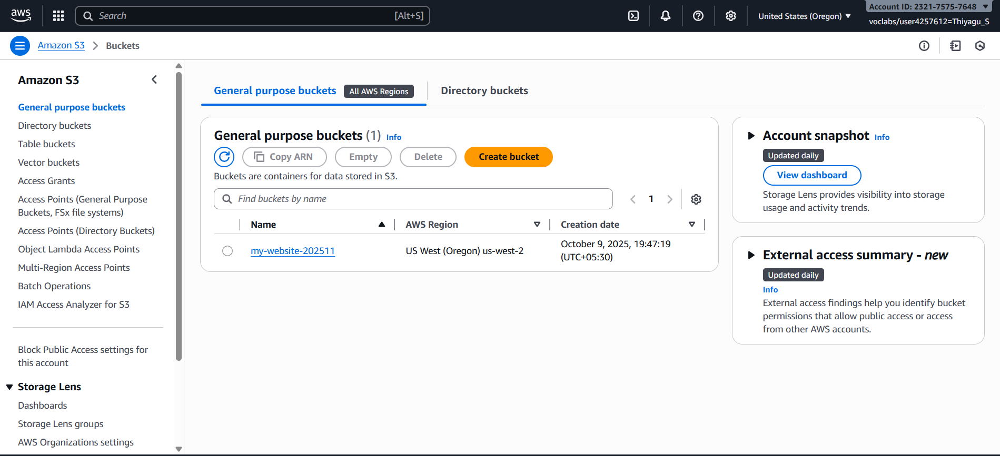
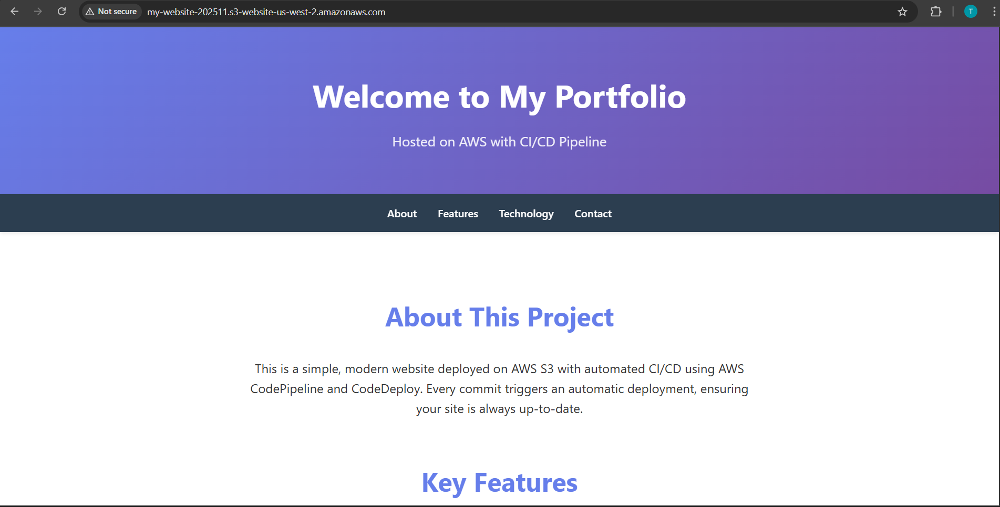
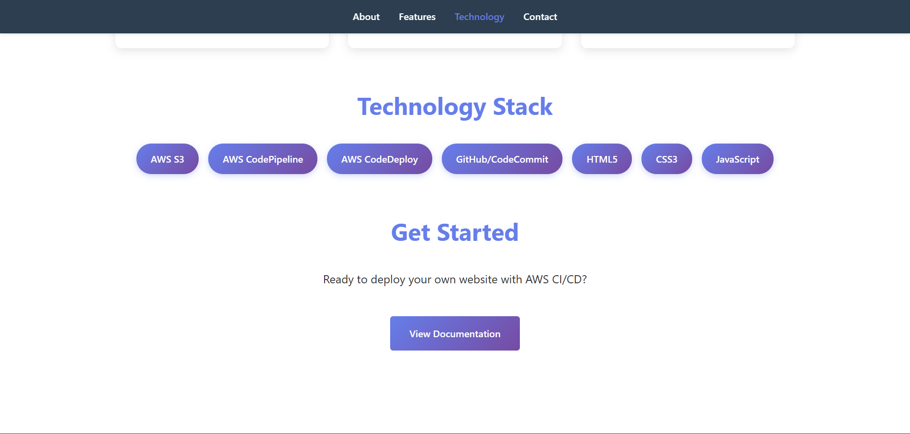

# 🚀 Deploying a Static Website on AWS S3 Static Web Hosting

This project documents the process of deploying a **simple static website** on **Amazon S3** using **S3 Static Website Hosting** feature.

---

## 🧠 Overview

I successfully hosted a static website on **AWS S3**, configured it for **public access**, and made it accessible through the **S3 bucket website endpoint**.
I also configured the **bucket policy** for public read access and set up **proper permissions** for static file hosting.

---

## 🛠️ Technologies Used

* **Amazon S3 (Simple Storage Service)**
* **AWS Management Console**
* **HTML, CSS** (Static website files)
* **WinSCP / AWS Console Upload** (for file transfer)
* **Bucket Policy** for public access

---

## ⚙️ Deployment Steps

### 🪣 Step 1: Create an S3 Bucket

1. Open the **AWS Management Console**.
2. Navigate to **S3** → Click **Create Bucket**.
3. Enter a **unique bucket name** (e.g., `my-static-website-demo`).
4. Choose a region (e.g., `ap-south-1`).
5. **Uncheck** “Block all public access”.
6. Acknowledge the warning and create the bucket.

**📸 Screenshot:**


---

### 📤 Step 2: Upload Website Files

1. Open your S3 bucket.
2. Click **Upload** → **Add files** and select your website files (`index.html`, `style.css`, etc.).
3. Click **Upload**.

---

### 🌐 Step 3: Enable Static Website Hosting

1. Go to your bucket → **Properties** tab.
2. Scroll to **Static website hosting** → Click **Edit**.
3. Select **Enable**.
4. Enter:

   * **Index document:** `index.html`
   * **Error document:** `error.html` (optional)
5. Click **Save changes**.

You’ll now see a **Website endpoint URL** (e.g. `http://my-static-website-demo.s3-website.ap-south-1.amazonaws.com`).

**📸 Screenshot:**


---

### 🔐 Step 4: Configure Bucket Policy for Public Access

1. Go to **Permissions** → **Bucket Policy**.
2. Add the following JSON policy (replace `your-bucket-name` with your actual name):

```json
{
  "Version": "2012-10-17",
  "Statement": [
    {
      "Sid": "PublicReadGetObject",
      "Effect": "Allow",
      "Principal": "*",
      "Action": "s3:GetObject",
      "Resource": "arn:aws:s3:::your-bucket-name/*"
    }
  ]
}
```

3. Save changes.


---

### 🌍 Step 5: Access Your Website

Now open the **S3 static website endpoint** in your browser:

```
http://your-bucket-name.s3-website.ap-south-1.amazonaws.com
```

Your static site should now be live 🎉

**📸 Screenshot:**




---

### ⚙️ Step 6: (Optional) Route 53 Custom Domain Integration

If you have a custom domain, you can integrate it with **Amazon Route 53** for a professional domain URL.
You can also enable **HTTPS** using **Amazon CloudFront**.

---

## ✅ Summary

* Deployed a **static website** on **AWS S3**
* Configured **public access** and **bucket policy**
* Enabled **S3 Static Website Hosting**
* Verified deployment via **S3 website endpoint**
* Configured **inbound/outbound access** and permissions

---

## 👤 Author

**Thiyagu S**
Deployed with ❤️ on **AWS Cloud** using **S3 Static Website Hosting**.

---
